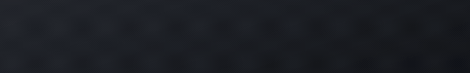
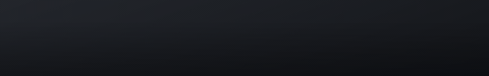
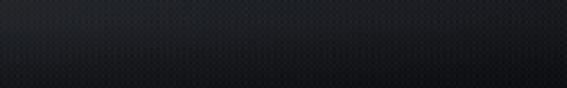
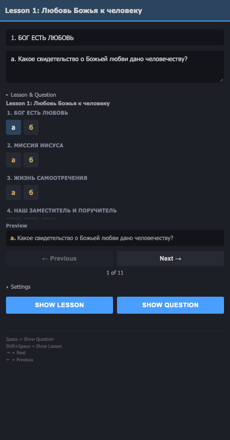

# SDARM Lesson Questions — OBS Lower Thirds

An overlay system for putting Sabbath School lesson questions on screen during a live
church broadcast. A control panel picks the lesson and the question; a second page
renders it as an animated lower third that OBS (or Wirecast) takes as a Browser Source.

The question **stays on screen until the presenter advances it**. That one requirement is
why this exists rather than being a configuration of something off the shelf — the
ready-made lower thirds all animate in, hold for a couple of seconds, and animate back
out, which is useless for a question the congregation is supposed to read and think about.

The repository started as a side-by-side comparison of three existing open-source lower
thirds projects. One of those, Vasco Cruz's `lower-thirds-obs`, became the base to build
on; what grew out of it is the system described here. The comparison is still in the repo
and still works — see [index.html](index.html).

## The three styles

Each one plays its entrance once and then holds. The previews below keep running for a
second and a half after the motion stops — that unchanging tail is the whole point, and on
stream it lasts as long as the presenter needs. The dark background stands in for the
video underneath; the overlay itself is genuinely transparent.

**Slash & Slide** — gold slash, text slides in from the left, left-aligned.



**Slide Up / Down** — centred, the heading rises from below while the question descends
from above.



**Quiet Rule** — right-aligned against a vertical gold rule that draws downward. Ours,
with no counterpart in the original.



The last two are shown with a long question so the wrapping is visible.

## The panel

The panel runs as a narrow dock inside OBS — this is roughly the width it actually gets.
Pick quarter, language and lesson once; after that a question is one click, and Previous /
Next walk the lesson without reopening anything.



## What it does

- **Picks questions from the real lessons.** The panel reads a built lesson bundle and
  offers Quarter → Language → Lesson → question. Clicking a question letter fills the
  overlay's two lines: the day heading, and the question itself. **22 languages.**
- **Steps through a lesson.** Previous / Next move between questions without reopening
  the list — the thing you actually do repeatedly during a stream.
- **Three animation styles**, picked by name with a small looping preview: Slash & Slide,
  Slide Up / Down, and Quiet Rule.
- **Genuinely transparent.** Real CSS alpha, so no Chroma Key filter in OBS — nothing gets
  accidentally keyed out of dark lesson text.
- **Works entirely offline.** No CDN, no Google Fonts, no network call at any point. The
  fonts are bundled. This is a hard requirement, not a preference — see
  [`native/fonts/README.md`](OBS_InforR-Lower/native/fonts/README.md).
- **Remembers your settings** between sessions (quarter, language, lesson).

## Getting started

Everything lives in `OBS_InforR-Lower/`.

**1. Build the lesson data.** The repository does not ship it (see
[Lesson content](#lesson-content) below), so this step is required — the panel's question
picker will not work without it:

```bash
cd OBS_InforR-Lower
python3 tools/build-lessons-data.py
```

This reads the per-language lesson files from `~/Developer/sbl/data/` and writes
`OBS_InforR-Lower/lessons-data.json`. Re-run it whenever a new quarter's files appear.

**2. Serve the folder over HTTP.** The panel `fetch()`es that JSON, which browsers refuse
under `file://`:

```bash
cd OBS_InforR-Lower
python3 -m http.server 8001
```

**3. Open the two pages.**

| Page | Where |
|---|---|
| `http://localhost:8001/panel.html` | The control panel — you type into this |
| `http://localhost:8001/result.html` | The overlay — add this to OBS as a Browser Source |

Both must be on the same `http://localhost:8001` origin; that is how they reach each
other. Fill in the two lines (or click a question), pick a style, press **Show**.

Full walkthroughs: [HOW-TO-USE-IN-OBS.md](HOW-TO-USE-IN-OBS.md) for the practical OBS
setup, [OBS_InforR-Lower/LOCAL-SETUP.md](OBS_InforR-Lower/LOCAL-SETUP.md) for how it works
and why it is built this way, [OBS_InforR-Lower/WIRECAST-SETUP.md](OBS_InforR-Lower/WIRECAST-SETUP.md)
for Wirecast.

## Browser ≠ OBS

Opening these files in Chrome or Safari shows you an approximation. OBS renders a Browser
Source through its own embedded engine (CEF), which can differ in fonts and spacing. Check
text and logic in a browser if you like, but **confirm the final look inside OBS itself** —
that is the only view that matches what goes out.

## What is here

```
OBS/
├── index.html                       — hub page comparing the plans, with screenshots
├── OBS_InforR-Lower/                — the system in actual use
│   ├── panel.html                   — control panel (OBS)
│   ├── result.html                  — overlay page, added to OBS as a Browser Source
│   ├── panel-wirecast.html          — control panel (Wirecast)
│   ├── result-wirecast.html         — overlay page (Wirecast)
│   ├── native/overlay.html/.css     — the overlay renderer and its animations
│   ├── native/fonts/                — bundled Open Sans + Arimo (OFL)
│   ├── tools/build-lessons-data.py  — builds lessons-data.json
│   └── lower.html, css/, js/, img/, scripts/  — Vasco Cruz's original, unchanged
├── OBS_Animated-Lower-Thirds/       — noeal-dac's project, kept for comparison
├── sbl-question-card/               — earlier question-extraction script
├── screenshots/                     — the previews above, plus the plan comparison shots
└── tests/                           — Playwright scripts that regenerate those screenshots
```

The OBS and Wirecast pairs exist separately because the two applications isolate browser
contexts differently: OBS's pages talk over `BroadcastChannel`, Wirecast's poll
`localStorage`. Same overlay underneath.

## Lesson content

`lessons-data.json` holds the full text of the SDARM Sabbath School lessons in 22
languages. **It is deliberately not published here** — that text belongs to whoever
publishes the lesson, not to this repository, and redistributing it is not ours to do.
The build script above regenerates it locally from your own copy of the lesson files. The
tooling is the part that is shared; the content is not.

## Credits and licence

The code written for this project is MIT — see [LICENSE](LICENSE).

**What is borrowed, and from whom:**

- **[lower-thirds-obs](https://github.com/vjccruz/lower-thirds-obs)** by **Vasco Cruz**
  (MIT) — `OBS_InforR-Lower/lower.html`, `css/`, `js/`, `img/`, `scripts/`, kept unmodified
  with his LICENSE and README intact. The current overlay no longer loads any of it, but
  it is where this started and it still works on its own terms.
- **[CodePen `mattchestnut/dMrONe`](https://codepen.io/mattchestnut/pen/dMrONe)** by
  **Matt Chestnut** — the motion design behind styles 1 and 2. The implementation in
  `native/overlay.css` is ours; the easing curve and offsets are his. Style 3, "Quiet
  Rule", is ours entirely.
- **Amaksi** — the After Effects template the CodePen itself was based on.
- **[Animated Lower Thirds](https://github.com/noeal-dac/Animated-Lower-Thirds)** by
  **noeal-dac** (MIT) — kept whole, for comparison, with its licence.
- **Open Sans** and **Arimo** — bundled under the SIL Open Font License 1.1, licences
  included in `OBS_InforR-Lower/native/fonts/`.

[AUTHORSHIP.md](AUTHORSHIP.md) goes through all of this file by file — who wrote what,
which parts are borrowed and how much, and what was checked to establish it.
