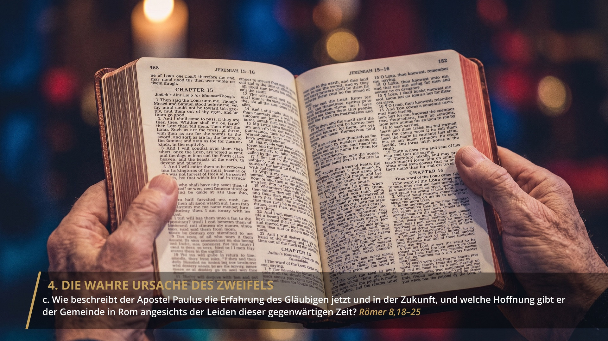
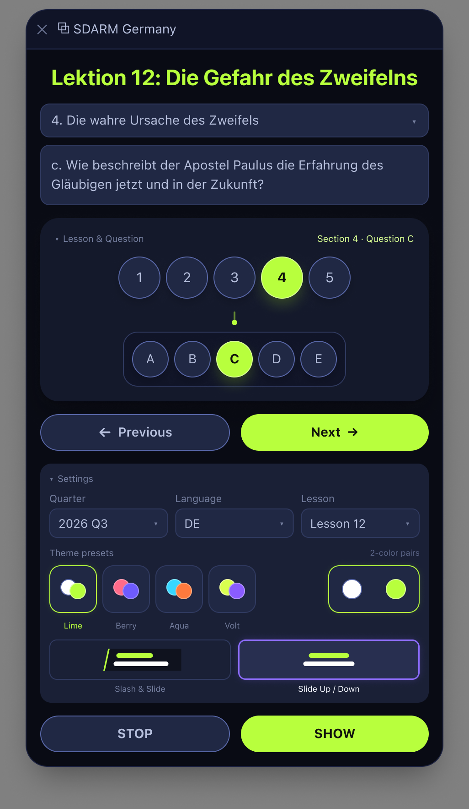
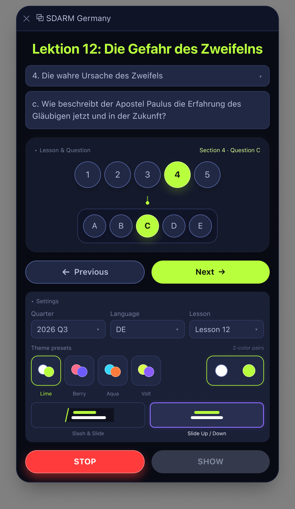
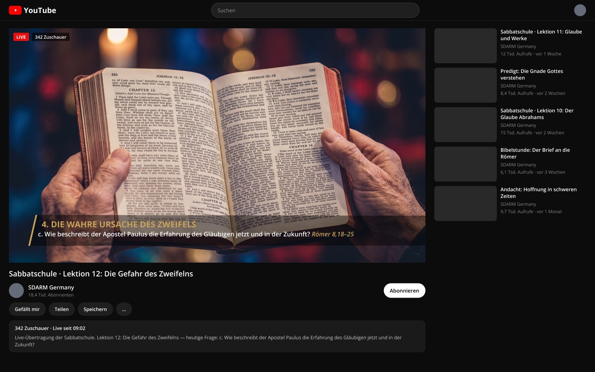

# SDARM Lesson Questions — OBS Lower Thirds

An overlay system for putting Sabbath School lesson questions on screen during a live
church broadcast. A control panel picks the lesson and the question; a second page
renders it as an animated lower third that OBS (or Wirecast) takes as a Browser Source.

### [▶ Live demo](https://themaestr-o.github.io/obs-sdarm-lessons/preview.html)

The real panel next to the real overlay, over a stand-in picture, in your browser — pick a
question, press **Show**, press **Next**, press **Stop**. It runs on sample lessons: the
real lesson text is never published (see [Lesson content](#lesson-content)).

The question **stays on screen until the presenter advances it**. That one requirement is
why this exists rather than being a configuration of something off the shelf — the
ready-made lower thirds all animate in, hold for a couple of seconds, and animate back
out, which is useless for a question the congregation is supposed to read and think about.

The repository started as a side-by-side comparison of three existing open-source lower
thirds projects. One of those, Vasco Cruz's `lower-thirds-obs`, was the starting point.
What grew out of it no longer shares any code with it, so the comparison and the borrowed
files have been removed — what is left is the system described here.

## The two styles

Each one plays its entrance once and then holds. The previews below keep running for two
seconds after the motion stops — that unchanging tail is the whole point, and on stream it
lasts as long as the presenter needs. The dark background stands in for the video
underneath; the overlay itself is genuinely transparent.

**Slash & Slide** — a translucent plate with its left edge cut at 13°, a gold stripe riding
the cut, the section heading in gold capitals and the question under it in white. The
stripe draws in first, the plate wipes out from behind it, then the words. A question that
wraps makes the plate taller; the slant stays on the same line.


**Slide Up / Down** — centred over a scrim, the heading rises from below while the question
descends from above. Shown with a long question so the wrapping is visible.


Both set the scripture reference that closes a question apart from it, in gold italic.

There is a third, **Quiet Rule** — right-aligned against a vertical gold rule. It still
renders if a scene asks for it (`id=3`), but the design settled on two and the panel offers
two.

### What changing the question looks like

The lower third does not come down and go back up every time. If the style stays the
same, the plate stays exactly where it is and only the line that actually changed slides
out and back — stepping from question *b* to question *c* moves one line. If the new
question needs another line, the plate grows to fit it. **Stop** plays the entrance in
reverse instead of cutting to nothing.

## The panel

The panel runs as a narrow dock inside OBS — this is roughly the width it actually gets.
Pick quarter, language and lesson once; after that a question is one click, and Previous /
Next walk the lesson without reopening anything.


## The design

Both the overlay and the panel are built to a Figma design, and the numbers in the CSS are
read off its frames rather than eyeballed. Every frame is exported to
[`screenshots/figma/`](screenshots/figma/) — the on-air frames for one- and two-line
questions in both styles, the transparent strips on their own, how it sits in a YouTube
live page, and the panel in both accent colours with Stop dark and lit.



 



The photographs in those frames are stand-ins for a camera feed. Nothing in them was
broadcast.

## What it does

- **Picks questions from the real lessons.** The panel reads a built lesson bundle and
  offers Quarter → Language → Lesson → question. Clicking a question letter fills the
  overlay's two lines: the day heading, and the question itself. **22 languages.**
- **Steps through a lesson.** Previous / Next move between questions without reopening
  the list — the thing you actually do repeatedly during a stream.
- **Two animation styles**, picked by name from a small looping miniature of each: Slash &
  Slide and Slide Up / Down.
- **Carries the scripture reference.** The lesson prints a reference after each question;
  the panel sends it along and the overlay sets it in gold italic at the end of the line.
- **Stop is lit while you are on air.** The panel's Stop button turns red for exactly as
  long as something is showing, and comes back lit if the dock is reopened mid-stream.
- **Genuinely transparent.** Real CSS alpha, so no Chroma Key filter in OBS — nothing gets
  accidentally keyed out of dark lesson text.
- **Works entirely offline.** No CDN, no Google Fonts, no network call at any point. The
  fonts are bundled. This is a hard requirement, not a preference — see
  [`native/fonts/README.md`](OBS_InforR-Lower/native/fonts/README.md).
- **All 22 languages in the project's own fonts** — Japanese, Chinese and Thai included,
  as cut-down Noto Sans files, so none of them depends on what the streaming machine
  happens to have installed. Every question of every language is rendered and measured by
  a sweep before a release: headings stay on one line, questions on one or two, nothing is
  clipped. The lesson's own letters are used — а, б, **ц** in Serbian, ก, ข in Thai,
  capitals in Portuguese — not an alphabet imposed from outside.
- **Remembers your settings** between sessions (quarter, language, lesson).

## Getting started

Everything lives in `OBS_InforR-Lower/`.

**1. Build the lesson data.** The repository does not ship it (see
[Lesson content](#lesson-content) below), so this step is required — the panel's question
picker will not work without it:

```bash
cd OBS_InforR-Lower
python3 tools/build-lessons-data.py
```

This reads the per-language lesson files from `~/Developer/sbl/data/` and writes
`OBS_InforR-Lower/lessons-data.json`. Re-run it whenever a new quarter's files appear.

**2. Serve the folder over HTTP.** The panel `fetch()`es that JSON, which browsers refuse
under `file://`:

```bash
cd OBS_InforR-Lower
python3 -m http.server 8001
```

**3. Open the two pages.**

| Page | Where |
|---|---|
| `http://localhost:8001/panel.html` | The control panel — you type into this |
| `http://localhost:8001/result.html` | The overlay — add this to OBS as a Browser Source |

Both must be on the same `http://localhost:8001` origin; that is how they reach each
other. Fill in the two lines (or click a question), pick a style, press **Show**.

**Or just look at it.** With that server running, open [`preview.html`](preview.html) —
double-clicking it is fine. It is the same page as the live demo: the panel beside the
overlay over a picture, with your real lessons instead of the samples.

Without step 1 the panel still works: it falls back to
`OBS_InforR-Lower/lessons-data.sample.json`, a handful of made-up questions in six
languages, and says so under its buttons.

Full walkthroughs: [HOW-TO-USE-IN-OBS.md](HOW-TO-USE-IN-OBS.md) for the practical OBS
setup, [OBS_InforR-Lower/LOCAL-SETUP.md](OBS_InforR-Lower/LOCAL-SETUP.md) for how it works
and why it is built this way, [OBS_InforR-Lower/WIRECAST-SETUP.md](OBS_InforR-Lower/WIRECAST-SETUP.md)
for Wirecast.

## Browser ≠ OBS

Opening these files in Chrome or Safari shows you an approximation. OBS renders a Browser
Source through its own embedded engine (CEF), which can differ in fonts and spacing. Check
text and logic in a browser if you like, but **confirm the final look inside OBS itself** —
that is the only view that matches what goes out.

## What is here

```
OBS/
├── index.html                       — hub page, with the style previews
├── preview.html                     — the live demo: panel beside overlay, in a browser
├── OBS_InforR-Lower/                — the system in actual use
│   ├── panel.html                   — control panel (OBS)
│   ├── result.html                  — overlay page, added to OBS as a Browser Source
│   ├── panel-wirecast.html          — control panel (Wirecast)
│   ├── result-wirecast.html         — overlay page (Wirecast)
│   ├── native/overlay.html/.css     — the overlay renderer and its animations
│   ├── native/fonts/                — bundled Open Sans + Arimo (OFL)
│   ├── lessons-data.sample.json     — made-up questions, used when there is no real bundle
│   ├── tools/build-lessons-data.py  — builds lessons-data.json, checks font coverage
│   └── tools/build-cjk-fonts.py     — cuts the Japanese / Chinese / Thai fonts
├── sbl-question-card/               — earlier question-extraction script
├── screenshots/                     — the previews above, plus the panel shot
└── tests/                           — Playwright script that regenerates those previews
```

The OBS and Wirecast pairs exist separately because the two applications isolate browser
contexts differently: OBS's pages talk over `BroadcastChannel`, Wirecast's poll
`localStorage`. Same overlay underneath.

## Lesson content

`lessons-data.json` holds the full text of the SDARM Sabbath School lessons in 22
languages. **It is deliberately not published here** — that text belongs to whoever
publishes the lesson, not to this repository, and redistributing it is not ours to do.
The build script above regenerates it locally from your own copy of the lesson files. The
tooling is the part that is shared; the content is not.

## Credits and licence

The code written for this project is MIT — see [LICENSE](LICENSE).

**What is borrowed, and from whom:**

- **[CodePen `mattchestnut/dMrONe`](https://codepen.io/mattchestnut/pen/dMrONe)** by
  **Matt Chestnut** — the motion design behind styles 1 and 2. The implementation in
  `native/overlay.css` is ours; the easing curve and the offsets are his. Style 3, "Quiet
  Rule", is ours entirely.
- **Amaksi** — the After Effects template the CodePen itself was based on.
- **Open Sans** and **Arimo** — bundled under the SIL Open Font License 1.1, licences
  included in `OBS_InforR-Lower/native/fonts/`.

This project began as a copy of
**[lower-thirds-obs](https://github.com/vjccruz/lower-thirds-obs)** by **Vasco Cruz**
(MIT), which is also how it reached the CodePen above. The overlay was rewritten from
scratch — it holds a question on screen instead of auto-hiding, which his could not be
made to do — and once nothing loaded his code, those files were removed. None of it
remains here, but it is where this started.

[AUTHORSHIP.md](AUTHORSHIP.md) goes through all of this file by file — who wrote what,
which parts are borrowed and how much, and what was checked to establish it.
